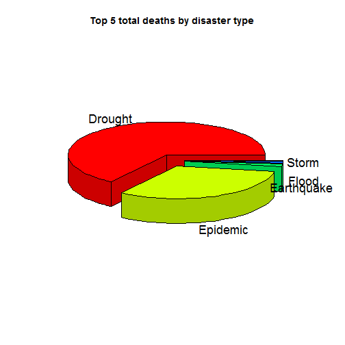

<style>
strong {
  font-weight: bold;
}
</style>
<style>
em {
  font-style: italic
}
</style>
## MINI ATLAS


Storms, floods and droughts are among the most recurrent weather-, climate- and water-related hazards around the world. However, the distribution of deaths and economic losses from these hazards varies from Region to Region. For example, the main contributors to the loss of life have been droughts in Africa; storms in Asia, in Central America, North America and the Caribbean, and in the South-West Pacific; floods in South America; and heatwaves in Europe. On the other hand, a large portion of economic losses has been attributed to floods in Africa, Asia, South America and Europe, and to storms in Central America, North America and the Caribbean, and the South-West Pacific.    
  
    

  This **Mini Atlas** allow us to discover the most deadly types of disaster and those that have more impact on the economy of a continent.

--- .class #id   

## Information about the dataset  
  
    
  The analysis provided in this Atlas is based on the CRED EM-DAT [*database*] (http://www.emdat.be/database), which contains data on disasters caused by several types of natural hazards - geophysical, meteorological, climatological, hydrological and biological - and technological disasters dating back to the year 1900. 
  
    
  The objective of developing and maintaining this database is to provide evidence to support humanitarian actions and the development of national and international programmes.


--- .class #id  

## Example of Code

```r
globe_20C_disaster <- read.csv("natural_disaster_globe_20C.csv", header = TRUE, sep = ",")
#Africa
africa_20C_disaster<-subset(globe_20C_disaster,continent=="Africa" & year<2000 )
af<-africa_20C_disaster[,-c(6,7,8)]
af_agg<-aggregate(af$Total.deaths,by=list(af$disaster.type),FUN = function(x){sum(as.numeric(x))})
names(af_agg)<-c("Type of disaster","Total of deaths")
af_agg<-af_agg[order(af_agg[2],decreasing = TRUE),]
head(af_agg,5)
```

```
##   Type of disaster Total of deaths
## 1          Drought         1692444
## 3         Epidemic          818920
## 2       Earthquake           36098
## 5            Flood           29750
## 9            Storm            7168
```

--- .class #id 

## Example of Plot


```r
library(plotrix)
pie3D(af_agg[1:5,2],labels=af_agg[1:5,1],explode=0.1,main="Top 5 total deaths by disaster type",radius=0.8)
```

 


--- .class #id 

## About this MINI ATLAS

Well you can see the application here:  

- [*shiny application*](https://chkifa.shinyapps.io/top5disaster/)  

and the code here:  

- [*code*](https://github.com/chkifa/top5disaster)


